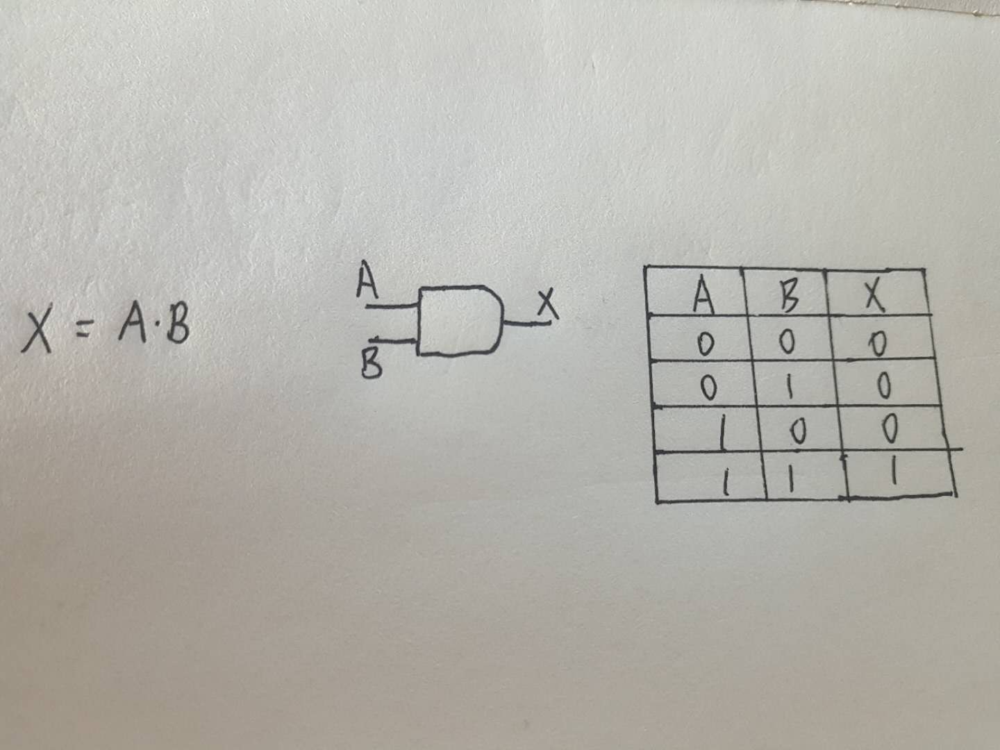
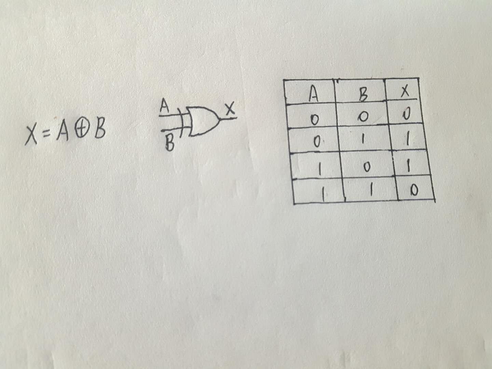
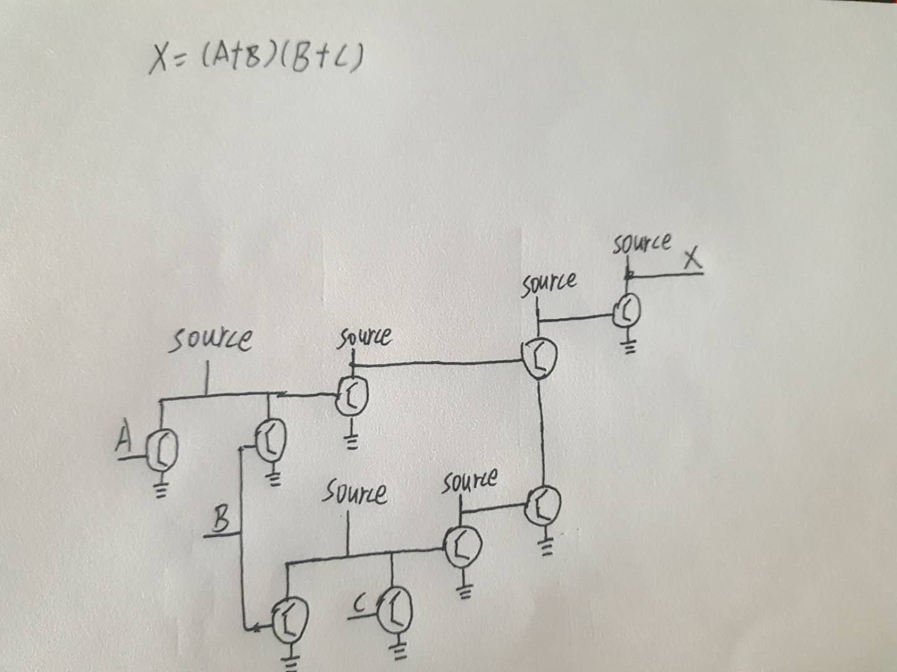
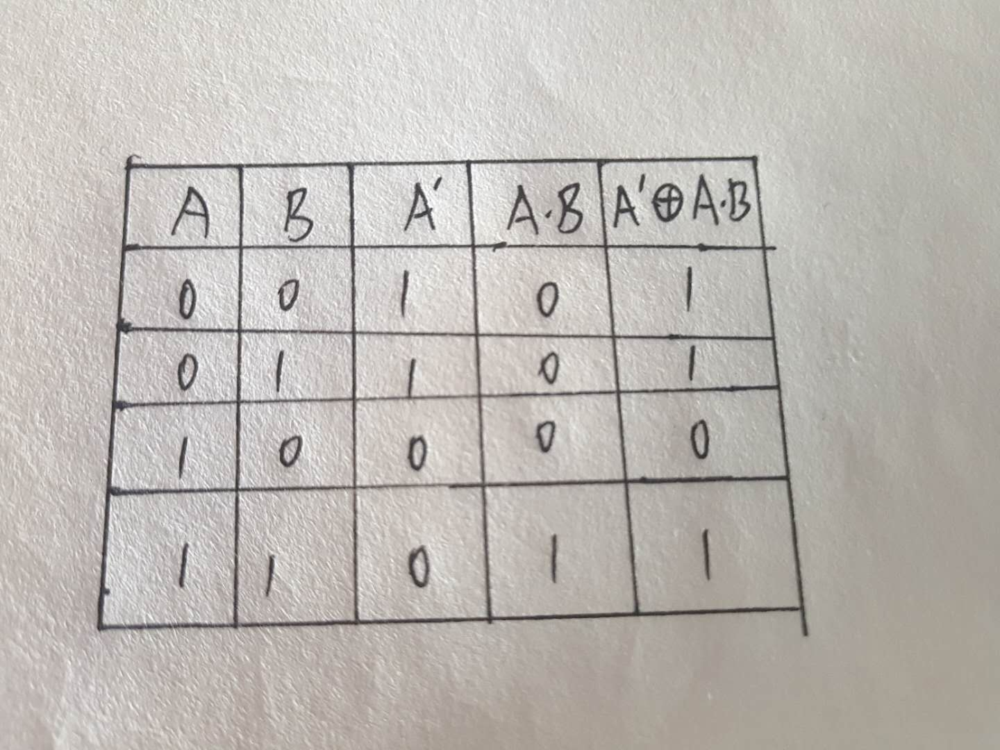
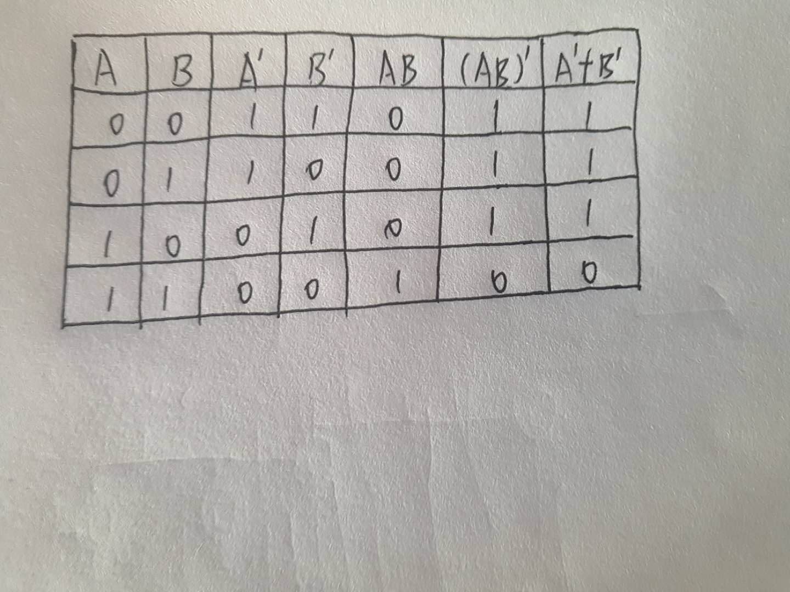

1) Give the three representations of an AND gate and say in your words what AND means. 

**当且仅当A与B同真则真**

2) Give the three representations of an XOR gate and say in your words what XOR means. 

**当且仅当A与B一真一假时为真**

3) Draw a circuit diagram corresponding to the following Boolean expression: (A + B)(B + C)

4) Show the behavior of the following circuit with a truth table:
.png)

5) What is circuit equivalence? Use truth table to prove the following formula. (AB)’ = A’ + B’

6) There are eight 1bit full adder integrated circuits. Combine them to 8bit adder circuit using the following box diagram.

.png)

.png)

7) Logical binary operations can be used to modify bit pattern. 

Such as (X8X7X6X5X4X3X2X1)2 and (00001111)2= (0000X4X3X2X1)2 

We called that (00001111)2 is a mask which only makes low 4 bits to work. 

Fill the follow expression 

(1)  (X8X7X6X5X4X3X2X1)2 or (00001111)2 = (X8X7X6X51111)2 

(2)  (X8X7X6X5X4X3X2X1)2 xor (00001111)2 = (X8X7X6X5X4'X3'X2'X1')2 

(3)  ((X8X7X6X5X4X3X2X1)2 and(11110000)2 ) or  (not (X8X7X6X5X4X3X2X1)2 and (00001111)2)  =  (X8X7X6X5X4'X3'X2'X1')2

                         

