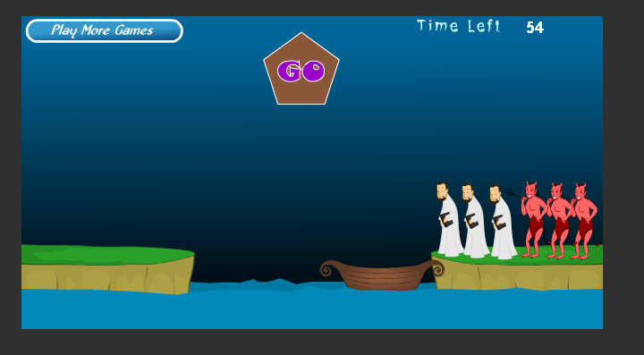

阅读“牧师与恶魔过河”（ http://www.17yy.com/f/69854.html）
的游戏介绍并玩游 戏。然后回答问题



– 游戏涉及哪些类。请列表说明 

* 背景
* 按钮
* 船
* 人物

– 游戏中有哪些对象，各几个。例如，船（一个） 

* 背景(五个）： 

渐变色的蓝色夜空

两块陆地

波动的海水

计分板

分数
* 按钮(两个)： 

左上角的“play more game”

上面的”Go”按钮
* 船(一个)： 

船
* 人物(两个)： 

牧师

恶魔

– 类和对象的区别是什么？举一个例子说明 

区别：类更像是一个对于一种东西的描述的集合，是一种概念，是无形的；对象则是类的一个具体化，它拥有所属类的全部特性，还可以拥有自己的特性，而且有着想比于类更加实体化的表达

例子：具体某一条狗，就是对象。

单纯说狗这是类，类其实就是类别， 类别关注共同的属性与行为，比如狗的属性：颜色、体重

狗的行为：啃骨头、撒尿。

具体某一条狗是什么颜色、多少体重这就是对象了。

– 游戏中的魔鬼，有哪些属性和方法？ 

属性：

大小
颜色
形状
位置

方法：

在船靠岸的时候，鼠标点击该对象能使该对象上船

在船上时，如果船靠岸，鼠标点击该对象可以使该对象下船

在船上时，点击“Go”按钮能够被船移动到另一块陆地

在船不靠岸/离岸时，若魔鬼人数大于牧师人数，则杀死牧师

– 假设魔鬼被鼠标点中，会执行onclick事件，请用文字 （伪代码）描述这个事件中魔鬼与其他对象沟通的过 程。 

```
IF 船 靠岸  THEN
    IF 魔鬼 在船上 THEN
        DO 下船1
        DO 上岸
    ELSE IF 魔鬼 在岸上 THEN
        IF 靠岸的一边 有 同类对象 THEN
            DO 上船2
        ELSE
            DO 上船1
        ENDIF
    ENDIF
ELSE
ENDIF
```

– 类或对象会是动词吗？

不会
