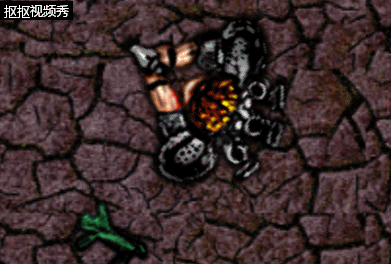

# 制作'Ghost Shooter'演示游戏

## 安装Construct 2

可直接[点击此处](https://www.scirra.com/construct2/releases/r262)下载并安装最新版本

## **新建任务**

.png)

`打开construct 2点击左上角的File及展开后出现的New>>New empty project`

## **插入对象**
### **平铺的背景**
`这是作为素材的背景纹理 - 右键单击​​它并将其保存到你的计算机某处`

`然后在刚才新建的Layout 1中的空白处双击鼠标左键,找到该项并再次双击鼠标左键`
.png)

`你会发现光标变成十字，现在在布局附近单击鼠标左键，点击弹出的窗口左上角红圈标出的导入按钮以导入上面我们保存的背景纹理，然后关闭这个界面`
.png)

`此时布局中即会出现我们所需的背景纹理，对着背景纹理或空白处可在左侧属性栏中查看北京纹理或空白布局的属性`
.png)

`将背景纹理及空白布局的size调至同一个尺寸以及将北京纹理的postion调为0，0以使背景纹理与空白布局重叠，这里尺寸不妨设为1280,1024的尺寸`

.png)

`为了方便游戏的制作，我们可以按住ctrl键同时上下滚动鼠标滚轮以缩放界面，也可以在与File同一栏的View中找到zoom to 100%将页面还原为正常尺寸`

### 添加图层
`我们现在设置好了游戏背景，为了不在制作游戏过程中误点到它，我们应当将其锁定成不可操作的对象再新建图层在新图层进行游戏的制作。在页面右侧的Layers栏中我们可以看见目前存在的图层也可以对它们进行修改。直到刚刚我们的Layers显示应当如图，我们不妨先将背景纹理所在的图层Layer 0改名为Background，这个操作可以通过鼠标左键点击以选中Layer 0之后点击那支小笔实现，然后我们点击那个锁即可将这个图层锁定，再之后点击+号以新建一个图层，同样的我们可以将它改名为Main，因为它将是我们游戏制作的主图层`

.png)

### 添加输入对象
`在布局中我们再次双击鼠标左键，找到并依次将鼠标和键盘导入，这个操作与上面我们导入背景纹理无异`

### 游戏对象
`游戏对象是游戏的主要成分，在本次制作中我们需要用到的游戏对象如下，将它们保存在你的计算机的某处`

player：

bullet:

monster:

explode:

`然后在我们的Main图层任意处双击鼠标左键，找到sprite类别双击并依次导入我们的四个游戏对象来使它们变成可操作的精灵对象。抑或直接将这四张图片依次鼠标拖动进布局，construct 2会自动完成这些步骤。此后我们会在右下角的objects处找到被命名为Sprite，Sprite2，Sprite3和Sprite4，这样当游戏变得复杂的时候我们将难以将它们区分，所以我们两次单击鼠标左键以重命名它们为Player，Monster，Bullet和Explosion。也可以在布局中左键单击它们，在左侧属性栏中对它们的name栏进行修改`
* 注意：请将子弹及爆炸特效拖动至布局以外的空白处(我们不希望在游戏开始时就见到它们)

### 添加行为
`先让我们来看看construct 2中的行为都有哪些`

- 8 Direction movement.这使您可以使用箭头键移动对象。它会很好地适应玩家的运动。
- Bullet movement. 这只是以当前角度向前移动一个物体。它对玩家的子弹很有用。尽管有这个名字，它也可以很好地移动怪物 - 因为所有的移动都是以某种速度向前移动物体。
- Scroll to.这使得屏幕在移动时跟随对象（也称为滚动）。这对玩家有用。
- Bound to layout.这将停止一个物体离开布局区域。这对玩家也很有用，所以他们不能在游戏区域外游荡！
- Destroy outside layout.而不是停止离开布局区域的对象，如果它停止，则会破坏它。它对我们的子弹很有用。没有它，子弹将永远飞离屏幕，总是占用一点内存和处理能力。相反，我们应该在他们离开布局后销毁子弹。
- Fade.这逐渐使物体淡出，我们将用于爆炸。

`添加行为，我们只需要选中需要操作的对象，在左侧属性栏中找到Behaviors栏并点击下方的Add一栏的Behaviors`

.png)

`下面找到并依次为这四个对象赋予这些行为`

* `player`:**8 Direction movement,Scroll to,Bound to layout**

* `bullet`:**Bullet movement,Destroy outside layout**

* `monster`:**Bullet movement**

* `explode`:**Fade**

`之后它们左侧对应的属性栏无疑会增加一些可供我们修改的数据，适当的修改它们的初始数据：选择Monster对象，将速度从400更改为80，同样，将Bullet对象的速度更改为600，将Explosion对象的淡入淡出行为的淡出时间更改为0.5。`

.png)

`通过按着ctcl拖动怪物可以实现生成多个怪物`

## 事件
`首先点击Event sheet 1切换到事件表编辑器以添加事件及对应的行为`
.png)

`接着添加如下内容`

* Add condition System -> Every tick

Add action Player -> Set angle towards position -> X: Mouse.X, Y: Mouse.Y

**通过这个操作来实现游戏中的player始终朝向鼠标**

* Condition: Mouse -> On click -> Left clicked (the default)

Action: Player -> Spawn another object ->  对于对象，选择Bullet对象。对于Layer，选择1（“Main”层是第1层 - 记住Construct 2从零开始计数）。将图像点保留为0。

**这个操作可以让player射出子弹，但如果我们真正运行游戏的话会发现子弹射出的位置是player的中心，这时我们就得设定一个新的图像点来使子弹正常射出，在界面右下方找到player，右键点击并找到Edit animations(编辑动画)点击，点击出现在窗口左下角圈出的那个小图标以设置新的图像点，再点击player的枪尖放置它，最后关闭界面回到上一步双击射出子弹的那个action将图像点改为1即可**

* Condition: Bullet -> On collision with another object -> 选择 Monster.

Action: Monster -> Destroy

Action: Bullet -> Spawn another object -> Explosion, layer 1

Action: Bullet -> Destroy

**这样便能使子弹命中怪物时杀死怪物并产生爆炸特效，但我们还需要一点操作来将爆炸的黑边去除：单击右下角的对象栏中的explode对象，或单击项目栏（带有图层栏的选项卡）。其属性显示在左侧的属性栏中。在底部，将其Blend mode属性设置为Additive。(为什么这样做？在不进入螺母和螺栓的情况下，将普通图像粘贴在屏幕顶部。利用加性效应，每个像素被添加（如在其中，求和）与其后面的背景像素。黑色是零像素值，因此不添加任何内容 - 您没有看到黑色背景。更亮的颜色会增加更多，所以显得更强烈。它非常适合爆炸和灯光效果。)**

* Condition: System -> On start of Layout

Action: Monster -> Set angle -> random(360)

* Condition: Monster -> Is outside layout

Action: Monster -> Set angle toward position -> For X, Player.X - for Y, Player.Y.

**通过这两个操作来使怪物变得聪明，一是让怪物初始的运动方向随机，二是使怪物离开界面后方向改为面向玩家**

* Condition: System -> Every X seconds -> 3

Action: System -> Create object -> Monster, layer 1, 1400 (for X), random(1024) (for Y)

**通过该操作使怪物定时生成在随即区域**

* Condition: Monster -> On collision with another object -> Player

Action: Player -> Destroy

**使怪物与玩家碰撞时会使玩家阵亡**

`我们或许会希望怪物被射击数次后死亡而非被瞬秒，那便需要进行一些改动：点击怪物，在它左侧的属性栏中找到图示一栏并新建number类型的变量，命名为health并设为一个你喜欢的数字`

.png)

`然后找到刚才子弹击中怪物时使怪物destroy的action并右键replace，将其改为以下action`

* Monster -> Subtract from  -> Instance variable "health", 然后输入你希望的伤害值. 

`我们需要设定新的怪物死亡事件如下`

* Condition: Monster -> Compare instance variable -> Health, 小于或等于, 0

Action: Monster -> Spawn another object -> Explosion, layer 1

Action: Monster -> Destroy

**这里的小于或等于需要注意，若仅用等于0而武器伤害会使怪物出现负血而跳过了0，那么怪物将永不会死亡**

## 设置记分板

* `首先我们需要记录分数，在event sheet 1界面的空白处单击鼠标右键，点击Add global variable以设置一个全局变量，不妨称它为Score，number类型且从0开始。找到之前设定的monster health<=0这一事件并设定一个新的action：system =》 Score目录下的add to并设为1`

* `然后我们需要一个记分板，让我们回到layout 1界面创建一个新图层，命名为HUD并在HUD中双击鼠标左键，找到text类型并双击，单击一下变为十字的光标放置记分板，可在左侧属性栏的Font处更改其字体，在Color处更改颜色。在system every tick这一事件下添加action  text->text目录下的set text并输入  "Score: " & Score`

**成品演示（局部）**

