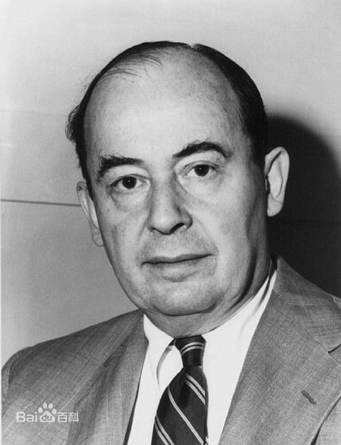

# **约翰·冯·诺依曼**

冯·诺依曼（John von Neumann，1903~1957），原籍匈牙利，布达佩斯大学数学博士。20世纪最重要的数学家之一，在现代计算机、博弈论、核武器和生化武器等领域内的科学全才之一，被后人称为“计算机之父”和“博弈论之父（涯杰）”。 
先后执教于柏林大学和汉堡大学，1930年前往美国，后入美国籍。历任普林斯顿大学、普林斯顿高级研究所教授，美国原子能委员会会员。美国全国科学院院士。早期以算子理论、共振论、量子理论、集合论等方面的研究闻名，开创了冯·诺依曼代数。第二次世界大战期间为第一颗原子弹的研制作出了贡献。为研制电子数字计算机提供了基础性的方案。1944年与摩根斯特恩（Oskar Morgenstern）合著《博弈论与经济行为》，是博弈论学科的奠基性著作。晚年，研究自动机理论，著有对人脑和计算机系统进行精确分析的著作《计算机与人脑》。
主要著作有《量子力学的数学基础》（1926）、《计算机与人脑》（1958）、《经典力学的算子方法》、《博弈论与经济行为》（1944）、《连续几何》（1960）等。

|              |                   | 
|:-------------|:------------------|
|中文名| 约翰·冯·诺依曼  | 
|外文名| John von Neumann|
|国籍| 匈牙利-美国 | 
|民族| 犹太人 | 
|出生地| 匈牙利布达佩斯| 
|出生日期|1903年12月28日|
| 逝世日期 | 1957年2月8日  | 
| 职业 | 数学家 计算机学家 物理学家 化学家    | 
| 毕业院校 | 苏黎世联邦工业大学化学系 布达佩斯大学数学系 | 
| 信仰| 天主教 | 
|主要成就|冯·诺依曼结构、博弈论|
|代表作品|《博弈论与经济行为》、《计算机与人脑》|



## 人物生平

```
冯·诺依曼，著名匈牙利裔美籍数学家、计算机科学家、物理学家和化学家 。1903年12月28日生于匈牙利布达佩斯的一个犹太人家庭。   
冯·诺依曼的父亲麦克斯年轻有为、风度翩翩，凭着勤奋、机智和善于经营，年轻时就已跻身于布达佩斯的银行家行列。冯·诺依曼的母亲是一位善良的妇女，贤慧温顺，受过良好教育。
冯·诺依曼从小就显示出数学和记忆方面的天才，从孩提时代起，冯诺依曼就有过目不忘的天赋，六岁时他就能用希腊语同父亲互相开玩笑。六岁时他能心算做八位数除法，八岁时掌握微积分，在十岁时他花费了数月读完了一部四十八卷的世界史，并可以对当前发生的事件和历史上某个事件做出对比，并讨论两者的军事理论和政治策略，十二岁就读懂领会了波莱尔的大作《函数论》要义。
微积分的实质是对无穷小量进行数学分析。人类探索有限、无限以及它们之间的关系由来已久，17世纪由牛顿莱布尼茨发现的微积分，是人类探索无限方面取得的一项激动人心的伟大成果。三百年来，它一直是高等学府的教学内容，随着时代的发展，微积分在不断地改变它的形式，概念变得精确了，基础理论扎实了，甚至有不少简明恰当的陈述。但不管怎么说，八岁的儿童要弄懂微积分，仍然是罕见的。上述种种传闻虽然不尽可信，但冯·诺伊曼的才智过人，则是与他相识的人们的一致看法。
1914年夏天，约翰进入了大学预科班学习，是年7月28日，奥匈帝国借故向塞尔维亚宣战，揭开了第一次世界大战的序幕。由于战争动乱连年不断，冯·诺依曼全家离开过匈牙利，以后再重返布达佩斯。当然他的学业也会受到影响。但是在毕业考试时，冯·诺依曼的成绩仍名列前茅（除体育和书写外，都是A）。
1921年，冯·诺依曼通过“成熟”考试时，已被大家当作数学家了。他的第一篇论文是和菲克特合写的，那时他还不到18岁。麦克斯由于考虑到经济上原因，请人劝阻年方17的冯·诺依曼不要专攻数学，后来父子俩达成协议，冯·诺依曼便去攻读化学。
其后的四年间，冯·诺依曼在布达佩斯大学注册为数学方面的学生，但并不听课，只是每年按时参加考试，考试都得A。与此同时，冯·诺依曼进入柏林大学（1921年），1923年又进入瑞士苏黎世联邦工业大学学习化学。1926年他在苏黎世联邦工业大学获得化学方面的大学毕业学位，通过在每学期期末回到布达佩斯大学通过课程考试，他也获得了布达佩斯大学数学博士学位。
冯·诺依曼的这种不参加听课只参加考试的求学方式，当时是非常特殊的，就整个欧洲来说也是完全不合规则的。但是这不合规则的学习方法，却又非常适合冯·诺依曼。
逗留在苏黎世期间，冯·诺依曼常常利用空余时间研读数学、写文章和数学家通信。在此期间冯·诺依曼受到了希尔伯特和他的学生施密特和外尔的思想影响，开始研究数理逻辑。当时外尔和波伊亚两位也在苏黎世，他和他们有过交往。一次外尔短期离开苏黎世，冯·诺依曼还代他上过课。聪慧加上得天独厚的栽培，冯·诺依曼在茁壮地成长，当他结束学生时代的时候，他已经漫步在数学、物理、化学三个领域的某些前沿。
1926年春，冯·诺依曼到哥廷根大学任希尔伯特的助手。1927～1929年，冯·诺依曼在柏林大学任兼职讲师，期间他发表了集合论、代数和量子理论方面的文章。1927年冯·诺依曼到波兰里沃夫出席数学家会议，那时他在数学基础和集合论方面的工作已经很有名气。
1929年，冯·诺依曼转任汉堡大学兼职讲师。1930年他首次赴美，成为普林斯顿大学的客座讲师。善于汇集人才的美国不久就聘冯·诺依曼为客座教授。
 冯·诺依曼曾经算过，德国大学里现有的和可以期待的空缺很少，照他典型的推理得出，在三年内可以得到的教授任命数是三，而参加竞争的讲师则有40名之多。在普林斯顿，冯·诺依曼每到夏季就回欧洲，一直到1933年担任普林斯顿高级研究院教授为止。当时高级研究院聘有六名教授，其中就包括爱因斯坦，而年仅30岁的冯·诺依曼是他们当中最年轻的一位。
在高等研究院初创时间，欧洲来访者会发现，那里充满着一种极好的不拘礼节的、浓厚的研究风气。教授们的办公室设置在大学的“优美大厦”里，生活安定，思想活跃，高质量的研究成果层出不穷。可以这样说，那里集中了有史以来最多的有数学和物理头脑的人才。
诺依曼和玛丽达·柯维斯结婚。1935年他们的女儿玛丽娜出生在普林斯顿。冯·诺依曼家里常常举办时间持续很长的社交聚会，这是远近皆知的。1937年冯·诺依曼与妻子离婚，1938年又与克拉拉·丹结婚，并一起回到普林斯顿。丹随冯·诺依曼学数学，后来成为优秀的程序编制家。与克拉拉婚后，冯·诺依曼的家仍是科学家聚会的场所，还是那样殷勤好客，在那里人人都会感到一种聪慧的气氛。
二次大战欧洲战事爆发后，冯·诺依曼的活动超越了普林斯顿，参与了同反法西斯战争有关的多项科学研究计划。1943年起他成了制造原子弹的顾问，战后仍在政府诸多部门和委员会中任职。1954年又成为美国原子能委员会成员。
冯·诺依曼的多年老友，原子能委员会主席斯特劳斯曾对他作过这样的评价：从他被任命到1955年深秋，冯·诺依曼干得很漂亮。他有一种使人望尘莫及的能力，最困难的问题到他手里。都会被分解成一件件看起来十分简单的事情，用这种办法，他大大地促进了原子能委员会的工作。
冯·诺依曼的健康状况一直很好，可是由于工作繁忙，到1954年他开始感到十分疲劳。
 1955年的夏天，X射线检查出他患有癌症，但他还是不停的工作，病势扩展。 后来他被安置在轮椅上，继续思考、演说及参加会议。长期而无情的疾病折磨着他，慢慢地终止了他所有的活动。1956年4月，他进入华盛顿的沃尔特·里德医院，1957年2月8日在医院逝世，享年53岁。
 ```

 ## 个人成就

 ```
 冯·诺伊曼是二十世纪最重要的数学家之一，在纯粹数学和应用数学方面都有杰出的贡献。他的工作大致可以分为两个时期：1940年以前，主要是纯粹数学的研究：在数理逻辑方面提出简单而明确的序数理论，并对集合论进行新的公理化，其中明确区别集合与类；其后，他研究希尔伯特空间上线性自伴算子谱理论，从而为量子力学打下数学基础；1930年起，他证明平均遍历定理开拓了遍历理论的新领域；1933年，他运用紧致群解决了希尔伯特第五问题；此外，他还在测度论、格论和连续几何学方面也有开创性的贡献；从1936～1943年，他和默里合作，创造了算子环理论，即所谓的冯·诺伊曼代数。
1940年以后，冯·诺伊曼转向应用数学。如果说他的纯粹数学成就属于数学界，那么他在力学、经济学、数值分析和电子计算机方面的工作则属于全人类。第二次世界大战开始，冯·诺伊曼因战事的需要研究可压缩气体运动，建立冲击波理论和湍流理论，发展了流体力学；从1942年起，他同莫根施特恩合作，写作《博弈论和经济行为》一书，这是博弈论（又称对策论）中的经典著作，使他成为数理经济学的奠基人之一。
 
冯·诺伊曼对世界上第一台电子计算机ENIAC（电子数字积分计算机）的设计提出过建议，1945年3月他在共同讨论的基础上起草了一个全新的“存储程序通用电子计算机方案”--EDVAC（Electronic Discrete Variable Automatic Computer的缩写）。这对后来计算机的设计有决定性的影响，特别是确定计算机的结构，采用存储程序以及二进制编码等，至今仍为电子计算机设计者所遵循。
1946年，冯·诺依曼开始研究程序编制问题，他是现代数值分析——计算数学的缔造者之一，他首先研究线性代数和算术的数值计算，后来着重研究非线性微分方程的离散化以及稳定问题，并给出误差的估计。他协助发展了一些算法，特别是蒙特卡罗方法。
40年代末，他开始研究自动机理论，研究一般逻辑理论以及自复制系统。在生命的最后时刻他深入比较天然自动机与人工自动机。他逝世后其未完成的手稿在1958年以《计算机与人脑》为名出版。
冯·诺伊曼的主要著作收集在《冯·诺伊曼全集》（6卷，1961）中。
无论在纯粹数学还是在应用数学研究方面，冯·诺依曼都显示了卓越的才能，取得了众多影响深远的重大成果。不断变换研究主题，常常在几种学科交叉渗透中获得成就是他的特色。
简单来说他的精髓贡献是两点：2进制思想与程序内存思想。
回顾20世纪科学技术的辉煌发展时，不能不提及20世纪最杰出的数学家之一的冯·诺依曼。众所 周知，1946年发明的电子计算机，大大促进了科学技术的进步，大大促进了社会生活的进步。鉴于冯·诺依曼在发明电子计算机中所起到关键性作用，他被西方人誉为“计算机之父”。而在经济学方面，他也有突破性成就，被誉为“博弈论之父”。在物理领域，冯·诺依曼在30年代撰写的《量子力学的数学基础》已经被证明对原子物理学的发展有极其重要的价值。在化学方面也有相当的造诣，曾获苏黎世高等技术学院化学系大学学位。与同为犹太人的哈耶克一样，他无愧是上世纪最伟大的全才之一。
冯·诺依曼在数学的诸多领域都进行了开创性工作，并作出了重大贡献。在第二次世界大战前，他主要从事算子理论、集合论等方面的研究。1923年关于集合论中超限序数的论文，显示了冯·诺依曼处理集合论问题所特有的方式和风格。他把集会论加以公理化，他的公理化体系奠定了公理集合论的基础。他从公理出发，用代数方法导出了集合论中许多重要概念、基本运算、重要定理等。特别在1925年的一篇论文中，冯·诺依曼就指出了任何一种公理化系统中都存在着无法判定的命题。
 
1933年，冯·诺依曼解决了希尔伯特第5问题，即证明了局部欧几里得紧群是李群。1934年他又把紧群理论与波尔的殆周期函数理论统一起来。他还对一般拓扑群的结构有深刻的认识，弄清了它的代数结构和拓扑结构与实数是一致的。他对算子代数进行了开创性工作，并奠定了它的理论基础，从而建立了算子代数这门新的数学分支。这个分支在当代的有关数学文献中均称为冯·诺依曼代数。这是有限维空间中矩阵代数的自然推广。冯·诺依曼还创立了博弈论这一现代数学的又一重要分支。1944年发表了奠基性的重要论文《博弈论与经济行为》。论文中包含博弈论的纯粹数学形式的阐述以及对于实际博弈应用的详细说明。文中还包含了诸如统计理论等教学思想。冯·诺依曼在格论、连续几何、理论物理、动力学、连续介质力学、气象计算、原子能和经济学等领域都作过重要的工作。
冯·诺依曼对人类的最大贡献是对计算机科学、计算机技术、数值分析和经济学中的博弈论的开拓性工作。
一般认为ENIAC机是世界第一台电子计算机，它是由美国科学家研制的，于1946年2月14日在费城开始运行。其实由汤米、费劳尔斯等英国科学家研制的“科洛萨斯”计算机比ENIAC机问世早两年多，于1944年1月10日在布莱奇利园区开始运行。ENIAC机证明电子真空技术可以大大地提高计算技术，不过，ENIAC机本身存在两大缺点：（1）没有存储器；（2）它用布线接板进行控制，甚至要搭接几天，计算速度也就被这一工作抵消了。ENIAC机研制组的莫克利和埃克特显然是感到了这一点，他们也想尽快着手研制另一台计算机，以便改进。
1944年，诺伊曼参加原子弹的研制工作，该工作涉及到极为困难的计算。在对原子核反应过程的研究中，要对一个反应的传播做出“是”或“否”的回答。解决这一问题通常需要通过几十亿次的数学运算和逻辑指令，尽管最终的数据并不要求十分精确，但所有的中间运算过程均不可缺少，且要尽可能保持准确。他所在的洛·斯阿拉莫斯实验室为此聘用了一百多名女计算员，利用台式计算机从早到晚计算，还是远远不能满足需要。无穷无尽的数字和逻辑指令如同沙漠一样把人的智慧和精力吸尽。
被计算机所困扰的诺伊曼在一次极为偶然的机会中知道了ENIAC计算机的研制计划，从此他投身到计算机研制这一宏伟的事业中，建立了一生中最大的丰功伟绩。
1944年夏的一天，正在火车站候车的诺伊曼巧遇戈尔斯坦，并同他进行了短暂的交谈。当时，戈尔斯坦是美国弹道实验室的军方负责人，他正参与ENIAC计算机的研制工作。在交谈中，戈尔斯坦告诉了诺伊曼有关ENIAC的研制情况。具有远见卓识的诺伊曼为这一研制计划所吸引，他意识到了这项工作的深远意义。
冯·诺依曼由ENIAC机研制组的戈尔德斯廷中尉介绍参加ENIAC机研制小组后，便带领这批富有创新精神的年轻科技人员，向着更高的目标进军。1945年，他们在共同讨论的基础上，发表了一个全新的“存储程序通用电子计算机方案”--EDVAC（Electronic Discrete Variable Automatic Computer的缩写）。在这过程中，冯·诺依曼显示出他雄厚的数理基础知识，充分发挥了他的顾问作用及探索问题和综合分析的能力。诺伊曼以“关于EDVAC的报告草案”为题，起草了长达101页的总结报告。报告广泛而具体地介绍了制造电子计算机和程序设计的新思想。这份报告是计算机发展史上一个划时代的文献，它向世界宣告：电子计算机的时代开始了。
EDVAC方案明确奠定了新机器由五个部分组成，包括：运算器、控制器、存储器、输入和输出设备，并描述了这五部分的职能和相互关系。报告中，诺伊曼对EDVAC中的两大设计思想作了进一步的论证，为计算机的设计树立了一座里程碑。
设计思想之一是二进制，他根据电子元件双稳工作的特点，建议在电子计算机中采用二进制。报告提到了二进制的优点，并预言，二进制的采用将大简化机器的逻辑线路。
计算机基本工作原理是存储程序和程序控制，它是由世界著名数学家冯·诺依曼提出的。美籍匈牙利数学家冯·诺依曼被称为“计算机之父”。
实践证明了诺伊曼预言的正确性。如今，逻辑代数的应用已成为设计电子计算机的重要手段，在EDVAC中采用的主要逻辑线路也一直沿用着，只是对实现逻辑线路的工程方法和逻辑电路的分析方法作了改进。
```
