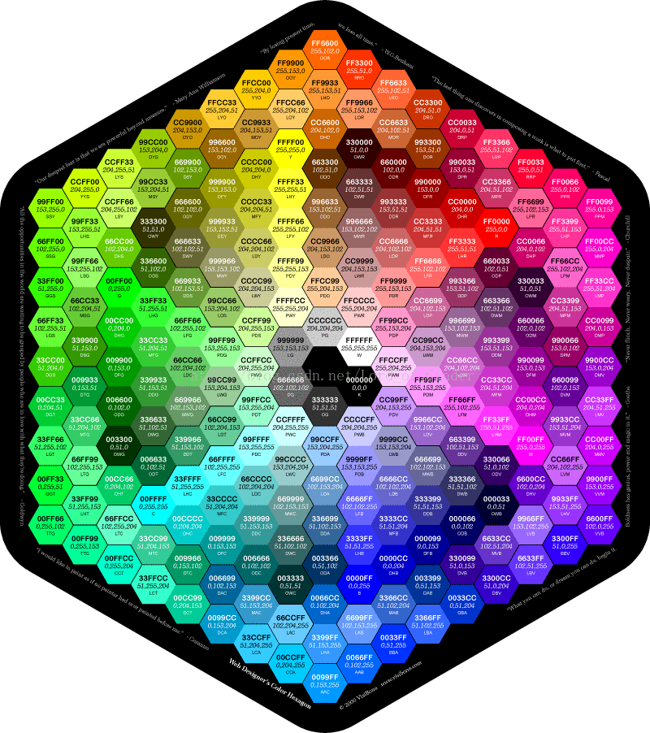

# 色彩表示与编码
## RGB

        RGB色彩模式是工业界的一种颜色标准，是通过对红(RED)、绿(GREEN)、蓝(BLUE)三个颜色通道的变化以及它们相互之间的叠加来得到各式各样的颜色的，RGB即是代表红、绿、蓝三个通道的颜色，这个标准几乎包括了人类视力所能感知的所有颜色，是目前运用最广的颜色系统之一。

       在电脑中，RGB的所谓“多少”就是指亮度，并使用整数来表示。通常情况下，RGB各有256级亮度，用数字表示为从0、1、2...直到255。

       红、绿、蓝三个颜色通道每种色各分为256阶亮度，在0时“灯”最弱——是关掉的，而在255时“灯”最亮。当三色灰度数值相同时，产生不同灰度值的灰色调，即三色灰度都为0时，是最暗的黑色调；三色灰度都为255时，是最亮的白色调。

       比如，红色：R：255  G：0  B：0       黑色：R：0  G：0  B：0       白色：R：255  G：255  B：255

## RGB的格式

网页中颜色通常以16进制代码来表示，形式为#ABCDEF，前两位、中两位、后两位分别表示红、绿、蓝光的亮度。

来源：CSDN 
原文：https://blog.csdn.net/lord_of_cinder/article/details/78563366?utm_source=copy 作者：Lord_of_Cinder 

