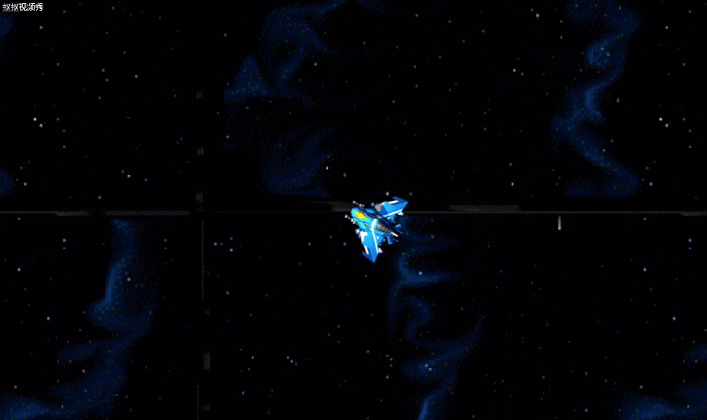

# HTML5游戏设计与制作(进阶篇)
## 1）游戏的策划
楔子(Setting)：你是一名被众多敌机包围的太空战士，是尽可能地歼灭敌人，还是选择灭亡。。
玩法(Gameplay):利用鼠标及方向键操控飞机发射炮弹消灭敌人
人设与道具（Game Sprites）：

* player
* monster
* bullet_player
* bullet_monster

## 2）游戏设计
.png)

```
+---------------------------------+  
| Object Name    player           |  
+---------------------------------+
| Attributes    蓝色飞机           |
+--------------+------------------+
| Collaborator | Events & Actions |
+--------------+------------------+
|    精灵      |朝向鼠标所指的方向  |
|              |鼠标点击会发射炮弹  |
|              |与怪物或怪物的炮弹碰撞会被摧毁 |
|              |被摧毁时出现爆炸特效|
+--------------+------------------+
```
```
+---------------------------------+  
| Object Name   monster           |  
+---------------------------------+
| Attributes    红色飞机           |
+--------------+------------------+
| Collaborator | Events & Actions |
+--------------+------------------+
|     精灵     |被玩家的炮弹击中五次会被摧毁|
|              |每三秒会发射炮弹|
|              |被摧毁时会出现爆炸特效|
+--------------+------------------+
```

```
+---------------------------------+  
| Object Name   bullet_player     |  
+---------------------------------+
| Attributes        蓝色子弹       |
+--------------+------------------+
| Collaborator | Events & Actions |
+--------------+------------------+
|     精灵     |与怪物碰撞时会时其HP减一|
|              |与怪物碰撞时产生爆炸特效并自身被摧毁|
+--------------+------------------+
```

```
+---------------------------------+  
| Object Name    bullet_monster   |  
+---------------------------------+
| Attributes         红色子弹      |
+--------------+------------------+
| Collaborator | Events & Actions |
+--------------+------------------+
|      精灵    |与玩家碰撞时摧毁玩家|
+--------------+------------------+
```


