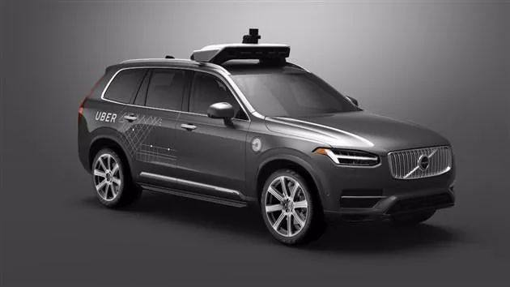
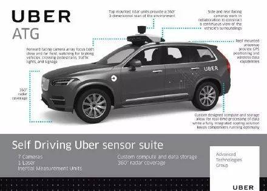
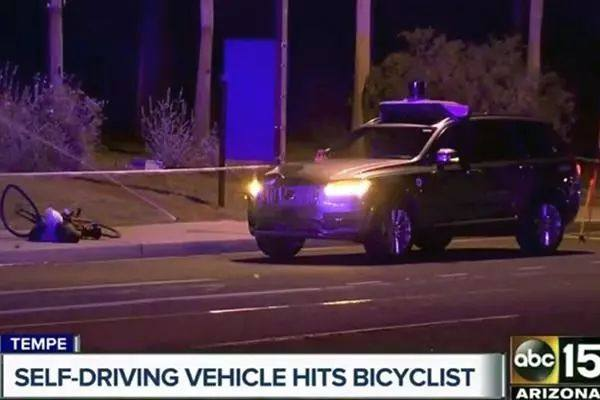

# 自动驾驶的伦理瓶颈 
自动驾驶时代已在眼前，但程序设计却遇到难题：当本车面临危险时，例如一辆渣土车翻来，本车若避险只有违章变道，甚至导致冲撞伤人，否则本车可能车毁人亡。若程序设计安排紧急避险，导致第三者伤亡，甚至重大伤亡事故，程序员可能面临司法调查和刑责；若不安排避险，则车可能卖不出去。这类似“扳道工难题”，但这是现实版的，不得不面对。 

柳下“实现哲学”有“存在之间相应实现，实现相应确定，作为实现的存在为主体”，任何脱离具体主体和超越视域的功利的考量都是无解的，无法确定哪个或哪几个人比另一个或另几个人对哪个主体更有价值。绝对价值不存在，柳下无意“为天地立心，为生民立命”，在法律不到位的情况下，价值问题还是交还给当事主体自己去处理吧，程序设计留下选择安装项，由车主选择“是”或“否”。 

但若要立法制约，则又拓展为是否允许转嫁危害的政治伦理问题。这又类似于“城市zha弹难题”，极端的情况是要保住一个无辜人的利益而放任地球上另外所有人痛苦而死。伦理是人为而不是先天绝对的，立法权是社会内容主体政治博弈的结果。

**来源：柳下哲学院**

我们先进入假想状态：在一个阳光明媚的日子，你坐在刚买的自动驾驶汽车一路向南疾驰在高速上。解放了双手的你惬意的享受着路边的美景和车内的零食，但在一个上坡路段，突然出现了一辆向北行驶的校车，它突然转向朝你冲来。这时你的车已经没时间刹停，你也无法控制方向盘完成紧急变线。

这时，你乘坐的自动驾驶汽车有三种选择：

* A. 紧急转向冲向树林，这样也许会救了校车和乘客，但可能会让你丢了小命；

* B. 紧急变线进入对向车道，保证自己的安全，牺牲校车司机和孩子们；

* C. 直接撞向校车，大家“同归于尽”。

在日常驾驶中，这种极端情况很少会出现。不过，对于自动驾驶汽车而言，这样的情况一旦发生就必须有应对措施。因此，做一个艰难的道德选择势在必行。

过去几年中，各家公司在自动驾驶领域已投入超过 800 亿美元，除了大家耳熟能详的 Waymo、Uber 和特斯拉，底特律巨头们也正在抓紧追赶。

这种曾经只存在于科幻电影中的产品可能几年后就会从我们身旁擦身而过，因此这个艰难的道德选择已经不再是停留在理论阶段的空想。

自动驾驶汽车的到来确实令人兴奋，它会让通勤变得更轻松，把堵车浪费的时间还给每个人。此外，它还能解决老年人和残疾人的出行问题，并挽救每年因交通事故枉死的数万条生命。

不过，在畅想自动驾驶汽车带来的好处时，我们也得直面它引发的问题，如人类司机的失业问题。从更深层次考虑，我们更是会面临一个存在主义问题：

在自动驾驶汽车面临两难困境时，到底该牺牲谁？谁又有权决定他人的生死？

 “即使进入自动驾驶时代，车祸也不可避免。”专攻自动驾驶汽车的问题的 Dykema 律师事务所律师 Van Lindberg 说。“车辆会遇到一些不寻常的事，如路边的树木突然倾倒，动物或孩子窜到路上。”虽然从整体来说自动驾驶汽车能救命，但如果代价是要牺牲自己时，恐怕没人愿意。

从现在的情况来看，很少有人着急去解决这些问题。

举例来说，美国国会和交通部正在审议的几项相关法案就在脚注中标明，伦理考量非常重要，但各方关于道德决策尚未达成共识。

不管自动驾驶技术有没有超人的能力，已经有人显出了自己对这些机器人选择能力的担忧。

去年，戴姆勒高管就因为关于该问题的公开表态遭到了批评。当时，他表示戴姆勒的自动驾驶汽车会优先考虑乘客的生命安全，这就意味着在关键时刻其他人的生命可以被牺牲。随后，戴姆勒坚称这位高管的表述被曲解了，因为这样的设定根本不可能得到立法部门的认可。

前不久，谷歌自动驾驶汽车之父 Sebastian Thrun 在接受彭博社采访时表示，自动驾驶汽车在设计之初就是为了避免事故发生，不过如果真的避无可避，它会选择牺牲“更小”的事物。

不过，如果这个更小的事物是个孩子呢？如何豁达这个问题对自动驾驶汽车的研发和普及会起到相当重要的作用。

加州大学艾尔文分校心理和社会行为学助理教授 Azim Shariff 去年做了一项研究。他发现虽然受访者通常会默认在不可避免的事故中杀伤的人数越少越好（不分乘客还是行人），但他们绝不会购买那种会威胁自己或者家人、朋友生命的自动驾驶汽车。

Shariff 也承认，自动驾驶汽车每年能挽救成千上万条生命，但人们的恐惧会拖慢它的普及步伐，有人驾驶与无人驾驶之间的“争夺”会持续很长时间。

美国汽车联合会的一项的调查也发现，受访的美国司机中，有四分之三都对自动驾驶汽车持怀疑的看法。

“这些道德问题可不止停留在理论的范畴。”加州理工大学伦理和新兴科学小组的导师 Patrick Lin 说道。

目前 Lin 领导的小组正与福特、特斯拉等自动驾驶汽车制造商讨论相关问题。虽然不能透露相关的讨论细节，但 Lin 称一些汽车制造商直接断定“伦理问题不足为虑”。

事实上，他们在研发过程中决定车辆能“看”到哪些物体，如何预测这些物体的动作和车辆应该做出的反应其实就是在做道德决断。

电脑会自始至终遵章守法吗？它看到小孩就一定会减速让行吗？工程师是否给它们灌输了“随机”反应程序？平时的模拟够吗？能告诉车辆不要杀人吗？这样的命令会被编进电脑的程序吗？

“这么多的棘手问题，恐怕很快会成为一团浆糊。”Lindberg 说道。“这么大的责任谁敢承担？恐怕在解答这些问题时大家很难达成共识。”

## 电车难题
被制造商和供应商们忽视的问题其实在哲学上有对应问题，它就是所谓的“电车难题”，而无论你拉不拉扳道器，疾驰的电车都会压死人。

在自动驾驶汽车上，情况也类似，如果车辆保护了乘客，那么行人就得死；如果车辆保护了行人，那么乘客就得死。车辆在这种两难的情况下必须做出选择。

“我考驾照的时候可不记得有这样一道考题。” 车载软件开发商 Elektrobit 的商业开发和通讯主管 Manuela Papadopol 说道。

如果有什么不同的话，那就是自动驶汽车几乎可以完全避免这种事情的发生，毕竟它离得很远就能“嗅探”到异样的感觉，而人类司机大多数会采用急刹车来躲避危险。

这就是自动驾驶汽车的优势，它们的刹车和传感器都有冗余，能尽早探测到危险并作出适当的反应。

“自动驾驶汽车会非常智能，因此我不认为这是个难题，它肯定会有自己的解决方案。” Papadopol 解释。

福特自动驾驶汽车部门发言人 Alan Hall 则认为自动驾驶汽车的探测能力远超人类，无论白天黑夜它们都能生成 360 度的传感器数据。

“车辆看到你的那一刻，就开始在脑子里构思各种不同的应对方案了，而那时它离你还远着。”他解释道。

在 Lin 看来，许多自动驾驶汽车制造商相信，简单的刹车或减速动作就能解决电车难题。不过他们可能太天真，如果车后紧跟着一辆狂奔的油罐车，恐怕就不会这么想了。

许多专家和分析师相信，要解决电车难题需要监管和立法者出面，他们得给自动驾驶汽车指定相应的应对方案。不过，也有人认为这些规矩无法囊括自动驾驶汽车会遇到的所有棘手情况。

此外，这个问题也不用像决定谁必须死那么恐怖。我们可以转换角度，决定如何整治那些乱穿马路的人，指定专用的行车道路或面对松鼠等小动物能否直接碾过去。

作为斯坦福大学汽车研究中心主管，Chris Gerdes 曾与福特、戴姆勒等公司探讨过这一问题。在他看来，这个问题的答案并非决定谁死，而是防止这种两难情况发生。此外，如果事情真的发生了，必须有个能判定责任的系统。

Gerdes 指出，加州法律要求车辆给人行横道上的行人让行，但同时也规定行人不能违反交通信号灯突然走上斑马线，包括密歇根在内的美国许多州都有类似的法律条文。

可以想象，在自动驾驶汽车正式上路之前，会有新的法律条文加入，规范自动驾驶汽车与行人的行为。

不过，这又会引发新的连锁反应，比如“自动驾驶汽车是否需要针对孩子专门设计新的应对方案？”“难道法律面前不该人人平等吗？”

这些问题的最终决定权还是会转到立法者、法庭和管理者的肩上，而这可能会引发美国许多法律法规的前后冲突，漫长的修补工作不可避免。

## 难解的困局
许多业内人士，比如特斯拉 CEO Elon Musk 就相信全自动驾驶汽车几年之内就能在美国上路。

不过也有观点认为，全自动驾驶至少 10 年之后才能投入使用。需要注意的是，许多人相信即使自动驾驶汽车或卡车已经达到了预定的所有技术标准，它们离正式上路也有一段距离。

想走完最后这段路，就必须先解决电车难题之类的困局，而且类似的困局还有很多，一只飞到窗户上的鸟，一个扔过来的球，甚至占住了前方车道的大车，可能都会让自动驾驶汽车“挠头”。

因此，汽车制造商需要决定自动驾驶汽车应该“看”到什么，又应该忽视什么。毕竟搜集周边的所有数据并进行运算是在浪费本就有限的计算能力。不过，如果它们这么做了，就会引发新的伦理道德问题。

随后，如何教会自动驾驶汽车掌握自己的任务也是个难题，毕竟以前这些工作只存在于科幻小说中。

虽然工程师可以给自动驾驶汽车灌入程序，如教它遇到校车时应该作何反应，但这里还存在其他选项。通过数百万英里的电脑模拟，自动驾驶汽车会不断学习总结，找到某种情况下的“最佳”应对方式。

举例来说，最近曝光的政府文档显示，Waymo 就在通过模拟中的试错来教会自动驾驶汽车如何处理一个麻烦的左转弯。因此，最终决定自动驾驶汽车行为的不是工程师或程序员，而是模拟。

通过这样的测试车辆就能找到从 A 点到 B 点的“最佳”方案（工程师版）。不过，结合现实情况的模拟和数据分享才能让它们真正学会执行任务。

当然，以下的事情更为科幻。

以横扫世界棋坛的 AlphaGo 为例，一开始是工程师通过编程让它学会如何下围棋的，但经过长时间的训练和模拟，它的落子却越来越不符合直觉，就连顶级围棋运动员也无法解释它的下棋方式。

那么如果故事的主人公从 AlphaGo 换成自动驾驶汽车呢？

伊浦西兰迪（密歇根州）的美国移动出行中心最近建成了一个自动驾驶汽车测试场，该中心负责人 John Maddox 表示，这里会成为自动驾驶汽车“极端”案例的测试场。

Maddox 为自动驾驶汽车准备了很多奇葩测试，如汽车驶入黑暗的隧道后可能马上会遇见一堵墙。车辆还要精确的预测路边的行人是否会走下马路牙子。

此外，该机构在测试中还有个艰巨的任务，即让公众了解自动驾驶汽车的能力，它们的运作方式和完全超越人类司机的安全性。

“一定的教育非常重要。”Maddox 说道。“我们要展示和说明自动驾驶汽车的工作方式和它们能力的局限性。”

至于电车难题，大多数汽车制造商和专家希望业内能出台一些标准，不过这个标准到底什么样，现在还没有相应的规划。

SAE International首席产品官 Frank Menchaca 对制定标准一事泼了冷水。他认为制定完美标准这个任务让人望而却步，毕竟一场交通事故会受很多因素影响，比如速度、位置、天气和机械性能等。

Menchaca 认为，即使我们有了标准，也无法回答在两难情况下到底谁更该“奉献”生命的问题。别忘了，这个问题最后还得人决定，而恐怕谁都不愿承担这个责任。

“人类经过成千上万年的进化，许多道德、伦理、宗教和社会习惯已经嵌入了我们的基因。”他补充道。“想把这些标准原封不动的复制出来可不容易。”

## 吊诡的场景
除了电车难题，自动驾驶汽车可能还会遇到以下吊诡的场景，解决起来也不容易：

1. 自动驾驶汽车在路上行驶时发现路两边有两拨行人，一拨人数多，而另一拨则只有一人。这时它是否应该给人数更多的那拨行人留下更多安全空间？如果这样做了，是否会增加那位独行行人被撞的几率？

2. 自动驾驶汽车是否应该学习人类驾驶员，在大卡车驶过时主动让出更多空间？这样会不会增加自己撞到另一边车道上车辆或行人的可能？

3. 如果自动驾驶汽车的词典里就没有“撞击行人”这个词，那么一旦有人要自杀（主动撞车），车辆是否会失控？

4. 如果一只狗突然冲了出来，或者麋鹿、松鼠之类，自动驾驶汽车是会直接撞过去？加速或刹车躲避？这样是不是就会增加撞到其他车辆的可能性？

5. 如果自动驾驶汽车智能到会躲避交通事故和拥堵，它们是否会蜂拥进入宁静的社区呢？如果真是这样，恐怕原本可以在社区奔跑打闹的孩子就危险了。同时，噪音变大的社区房地产价值也会随之缩水。

**来源：雷锋网**

