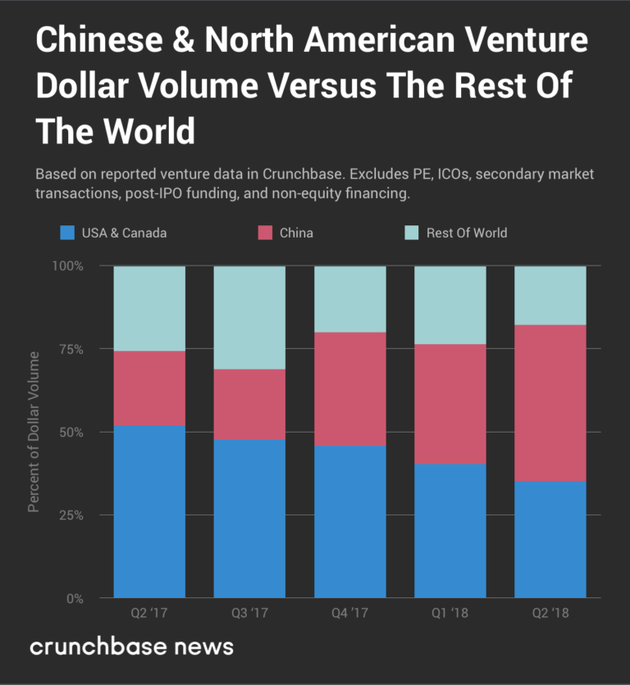
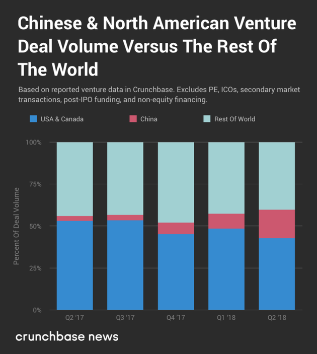

# IT风投之我见

## 1.何为风投
* 风险投资（英语：Venture Capital，缩写为VC）简称风投，又译称为创业投资，是一种私募股权，一种融资形式，由公司或基金提供给被认为具有高增长潜力或已经表现出高增长的小型早期新兴公司（员工数量，年收入或两者兼而有之）。
* 典型的风险资本投资发生在最初的“种子资金”轮次之后。第一轮为增长提供资金的机构风险资本被称为A轮融资。风险资本家提供此融资是为了通过最终的“退出”事件产生回报，例如公司首次在首次公开募股（IPO）中向公众出售股票或进行并购（也称为作为公司的“贸易销售”）。风险投资公司或基金投资于这些早期阶段的公司，以换取他们投资的公司的股权或所有权股份。风险投资家承担风险，为有风险的初创公司提供融资，希望他们有些公司能够支持将成功。主要是指向初创企业提供资金支持并取得该公司股份的一种融资方式。
* 风险投资是私人股权投资的一种形式。风险投资公司为一专业的投资公司，由一群具有科技及财务相关知识与经验的人所组合而成的，经由直接投资被投资公司股权的方式，提供资金给需要资金者（被投资公司）。风投公司的资金大多用于投资新创事业或是未上市柜企业（虽然现今法规上已大幅放宽资金用途），并不以经营被投资公司为目的，仅是提供资金及专业上的知识与经验，以协助被投资公司获取更大的利润为目的，所以是一追求长期利润的高风险高报酬事业。

除了天使投资，股权众筹和其他种子融资选择外，风险投资对于经营历史有限的新公司具有吸引力，这些公司规模太小，无法在公开市场筹集资金，也没有达到能够获得银行资金的程度。为了换取风险资本家通过投资于较小的早期公司而承担的高风险，风险资本家通常会对公司决策进行重大控制，此外还有很大一部分公司的所有权（以及价值）。 Uber，Airbnb，Flipkart，小米和滴滴出行等初创公司都是高度重视的创业公司，风险资本家为这些早期公司提供的不仅仅是融资;他们还经常就公司业务模式和营销策略向公司高管提供战略建议。    
————来自中文维基

## 2.著名的风投公司

在国外有：

**红杉资本**

红杉资本于1972年在美国硅谷成立。在成立之后的30多年之中，红杉作为第一家机构投资人投资了如Apple, Google, Cisco，Oracle, Yahoo, Linkedin等众多创新型的领导潮流的公司。在中国，红杉资本中国团队目前管理约20亿美元的海外基金和近40亿人民币的国内基金，用于投资中国的高成长企业。红杉中国的合伙人及投资团队兼备国际经济发展视野和本土创业企业经验，从2005年9月成立至今，在科技、消费服务业、医疗健康和新能源/清洁技术等投资了众多具有代表意义的高成长公司。 
红杉中国的投资组合包括新浪网、阿里巴巴集团、土巴兔、酒仙网、万学教育、京东商城、文思创新、唯品会、聚美优品、豆瓣网、诺亚财富、高德软件、乐蜂网、奇虎360、乾照光电、焦点科技、大众点评网、美团网 、中国利农集团、乡村基餐饮、斯凯网络、博纳影视、开封药业、秦川机床、快乐购，蒙草抗旱、匹克运动、火币网等。

**KPCB**

KPCB公司（Kleiner Perkins Caufield & Byers）成立于1972年，是美国最大的风险基金，主要是承担各大名校的校产投资业务。在其所投资的风险企业中，有康柏公司、太阳微系统公司、莲花公司等这些电脑及软件行业的佼佼者，随着互联网的飞速发展，公司抓住这一百年难觅的商业机遇，将风险投资的重点放在互联网产业，先后投资美国在线公司、奋扬公司（EXICITE）、亚马逊书店。KPCB公司最得意的杰作是网景公司的创立，网景公司的成功刺激了许多风险资本家投入互联网产业，KPCB公司更是一发不可收，投资并推动10多家网络公司上市。KPCB公司所投资的各个网络科技公司是相互关联的，各个公司的董事相互兼任其他有关公司的董事，这可以使他们将个人所总结的市场趋势的分析来共同分享。互联网产业是一个迅速发展的产业，游戏规则不是以往的竞争，而是相互联合，共同扩展客户数，共同占领市场。互联网产业策略联盟和兼并收购蔚然成风，不结成联盟就难以独自发展。KPCB公司把握网络业这一特点，投资那些可以在技术上相互配合、相互促进、共同抢占市场的网络科技公司，包括网景、美国在线、亚马逊书店、美国体育沿线等多家公司。

那么国内有什么公司呢？

**上海云峰投资管理有限公司**

云锋基金成立于2010年初，是以阿里巴巴董事局主席马云和聚众传媒创始人虞锋的名字命名而成，并联合一批行业领袖、成功企业家和成功创业者共同发起创立的私募基金。其宗旨是除了投入资金外，把各自的创业经验与企业分享，在发展战略、组织管理、品牌建设等方面帮助企业更好发展，关注年轻的企业家，创造下一代的领导者，培育未来有影响力的企业。目前云锋基金旗下拥有多支美元基金、人民币基金和专项基金。云锋基金主要涉足互联网、医疗、大文娱、金融、物流与消费等领域。

**北京创新方舟科技有限公司(创新工场)**

创新工场（Sinovation Ventures）由李开复博士创办于2009年9月，是一家致力于早期阶段投资，并提供全方位创业培育的投资机构与创业平台，旨在培育创新人才和新一代高科技企业。 
创新工场通过针对早期创业者需求的资金、商业、技术、市场、人力、法律、培训等提供一揽子服务， 帮助早期阶段的创业公司顺利启动和快速成长。同时帮助创业者开创出一批最有市场价值和商业潜力的产品。创新工场的投资方向将立足信息产业最热门领域：移动互联网、消费互联网、电子商务和云计算。

举例来源：CSDN 

原文：https://blog.csdn.net/Cynosure0816/article/details/78868817 

## 3.中国风投的快速发展

新浪科技讯 北京时间7月4日上午消息，初创公司及投资机构数据库Crunchbase最近公布报告，对2018年二季度全球风险投资（VC）市场进行总结。交易数据显示，不论是全球还是北美，二季度风投交易宗数和交易金额都在上升。中国为全球风投市场的升温贡献了自己的力量。数据显示，二季度，中国创业公司融入的风投资金比北美还要多。
　　二季度，在所有风投融资中，中国创业公司占了47%的份额，美国、加拿大企业合计占了35%。请注意，这是中国企业的风投融资额**第一次**超过美国加拿大企业。

**2017年第二季度-2018年第二季度，不同地区风投金额规模比例**

在中国企业的融资中，大宗交易占了很高的比重。例如，6月初，蚂蚁金服融资140亿美元，它相当于公司的C轮融资。到目前为止，这是历史上规模最大的单轮融资交易。淡马锡和GIC领投，蚂蚁金服估值达到1500亿美元，这个估值相当于Uber估值的两倍，和亚马逊创始人杰夫·贝索斯（Jeff Bezos）的净资产差不多。

　　如果将蚂蚁金服的融资剔除，那么中国创业公司二季度的融资额只比一季度稍多。不考虑蚂蚁金服融资交易，二季度中国创业公司融资额占了全球总融资额的36%，与一季度的比重是一样的。

　　再看交易宗数。2018年二季度，中国创业公司完成的融资交易宗数同比增长395%。由于语言障碍及其它因素的影响，Crunchbase收集的数据很难覆盖整个中国创业市场。数据库只会收集一些规模较大的融资交易，并从新闻中收集信息，至于种子融资、早期交易，Crunchbase没有完全覆盖。

**2017年第二季度-2018年第二季度，不同地区风投交易宗数比例**

虽然交易宗数增加，但是中国企业完成的交易宗数在总数中所占的比重并不高，至少与交易金额所占的比重相比不算高。腾讯、阿里巴巴等企业在风险投资领域注入大量资金，国有风投公司也在向中国及海外市场投资，按需服务和交通运输行业出现横向合并，形成更强大的企业。由于没有出现立即减速的迹象，中国科技和风投生态系统将会保持目前的膨胀态势，未来在全球投资市场会扮演更重要角色。