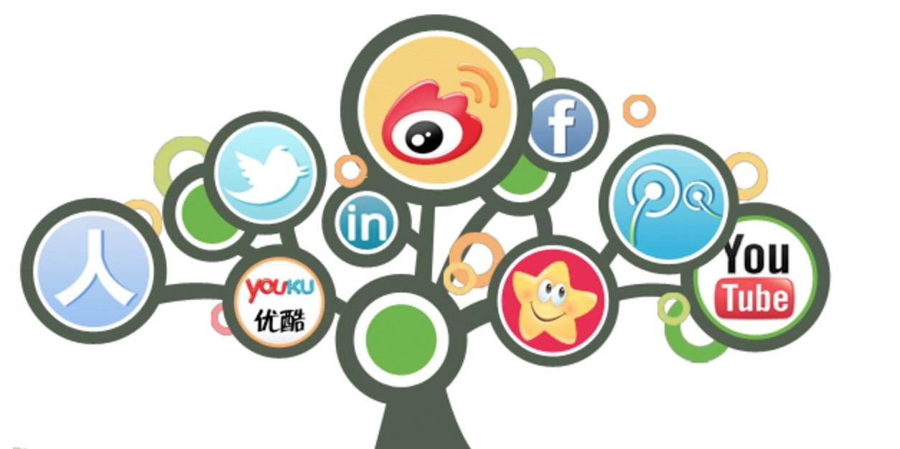
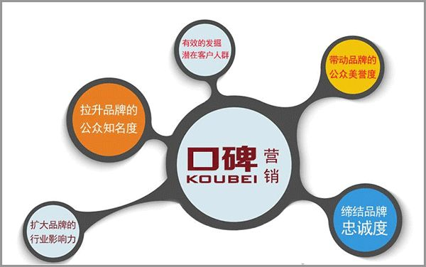
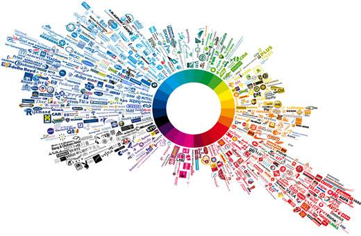

## 介绍互联网时代的热点领域选择、营销方法

### 1.热点领域
**ipv6**

ipv4资源的日益短缺，目前已近到了最后时刻，几个帝国主义国家已近非常普及ipv6，而我泱泱大国在这块支持还远远不够，我们的高速公路可以，但是信息高速公路就没有那么好了。

**python**

得益于大数据、人工智能的飞速发展，python语言越来越火爆，几乎干掉了所有的竞争对手。

**大数据**

无需多言，数据的重要性，现在连街上卖菜的大妈也知道了。

**自媒体**

传统媒体从报纸、收音机、电视、门户网站不断的萎缩，自媒体更是个性的展现。

**人工智能**

到底有多智能？新的人工智能解决思路直接决定了这个答案的高度有多高。

**区块链**

一个新兴的技术方向，也许会是下一个互联网革命的方向。

**物联网**

万物互联，一个充满期待的未来。你，等着。
### 2.营销方法
一、饥饿营销  
饥饿营销是指商品提供者有意调低产量，以期达到调控供求关系、制造供不应求“假象”、以维护产品形象并维持商品较高售价和利润率的营销策略。

关键词：“抢不到”

二、口碑营销  
口碑营销是指企业在品牌建立过程中，通过客户间的相互交流将自己的产品信息或者品牌传播开来。 

关键词：“赞多势重”

三、借势营销  
借势营销通过创意将产品附着在有巨大传播力大家众所周知的热点事件上，很容易就会获得大量传播。 

关键词：”站在风口上的猪“

四、病毒营销  
病毒营销是利用公众的积极性和人际网络，让营销信息像病毒一样传播和扩散，营销信息被快速复制传向数以万计、数以百万计的观众，它能够像病毒一样深入人脑，快速复制，迅速传播，将信息短时间内传向更多的受众。 

关键词：”刷爆朋友圈“

五、跨界营销  
co-branding，跨界营销，可以说是现阶段除了互联网思维和饥饿营销以外被炒得最热的词汇了。两个看似毫不搭噶的品牌，根据各自的特点和优势，相互契合渗透，优势互补，达到1+1>2的效果。 

关键词：”混搭“